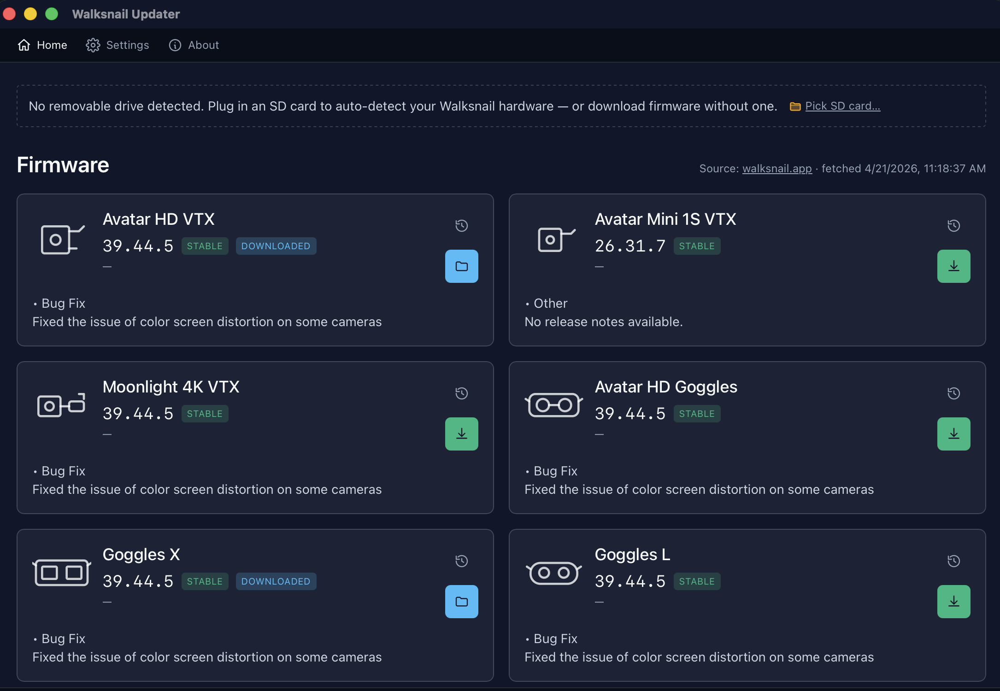

<p align="center">
  
</p>

<h1 align="center">Walksnail Updater</h1>

<p align="center">
  A small desktop app that flashes Walksnail Avatar HD firmware without the usual faff.
</p>

<p align="center">
  <a href="https://github.com/iksaif/walksnail-updater/actions/workflows/ci.yml"></a>
  <a href="https://github.com/iksaif/walksnail-updater/releases"></a>
  
  
  <a href="LICENSE"></a>
  
</p>

---

> **Unofficial.** Not affiliated with Walksnail or CADDXFPV. Trademarks belong
> to their owners. Flash at your own risk — bricks are not on me.

## What it does

Plug in your SD card. The app figures out which Walksnail you own, grabs the
latest firmware, drops it on the card with the right filename, and tells you
which buttons to hold. No SD plugged in? Download firmware anyway and drag
it across later.

- Recognises every variant by filename: `Avatar_Sky`, `AvatarX_Gnd`,
  `AvatarMini_Gnd`, `AvatarMoonlight_Sky`, etc.
- Reads DVR `.srt` sidecars to find the firmware actually running on the
  device (not just what's staged).
- Blocks the known bricks (Goggles X below `38.44.13`, Avatar GT below
  `39.44.2`) and makes you type out downgrade confirmations.
- Ships every release's changelog so you can pick a past version.
- Instructions come from the upstream product PDFs, parsed at build time.

## Screenshot

<!-- Replace with a real screenshot once the app has run on a machine. -->
<p align="center">
  
</p>

## Install

Grab the file for your OS from the [Releases](../../releases) page:

- macOS: `.dmg`
- Windows: `.msi`
- Linux: `.AppImage` or `.deb`

Verify the SHA against the release asset, then run the installer.

## Build from source

```bash
npm ci
npm run tauri:dev      # run with HMR
npm run tauri:build    # produce installers in src-tauri/target/release/bundle
```

Linux also needs: `libwebkit2gtk-4.1-dev libappindicator3-dev librsvg2-dev patchelf libgtk-3-dev`.

Rust tests:

```bash
cargo test --workspace --exclude walksnail-updater
```

Refresh instructions from upstream PDFs:

```bash
cargo run -p manuals --bin refresh
```

## Sources

- Firmware index: [D3VL/Avatar-Firmware-Updates](https://github.com/D3VL/Avatar-Firmware-Updates)
- Official downloads: [caddxfpv.com/pages/download-center](https://www.caddxfpv.com/pages/download-center)
- Wiki: [walksnail.wiki](https://walksnail.wiki/en/firmware)

## License

[MIT](LICENSE). No warranty.
